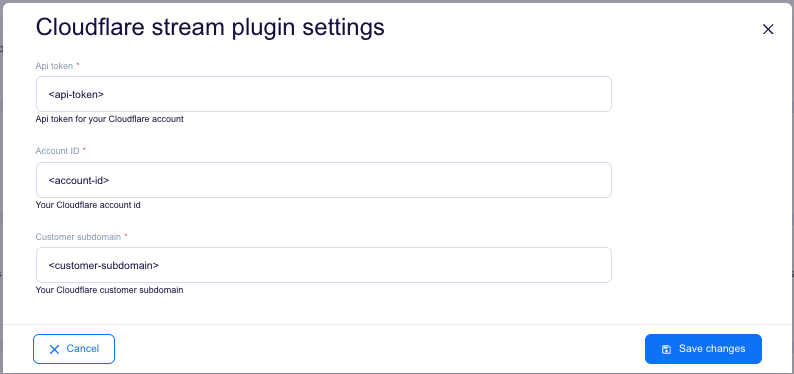
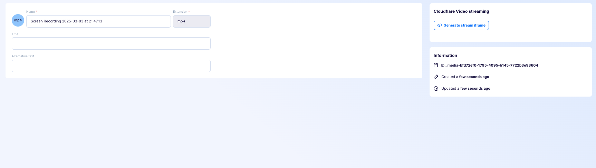
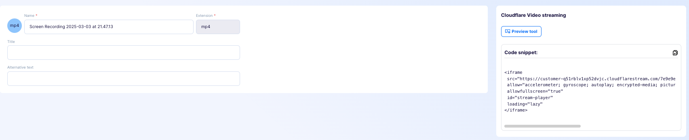
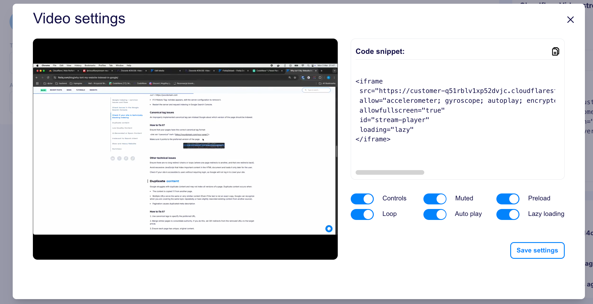
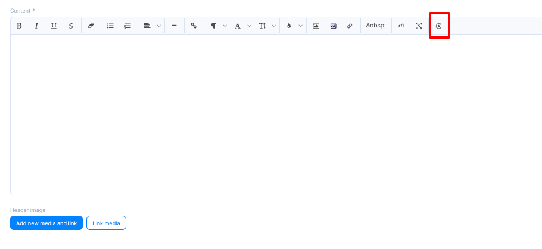
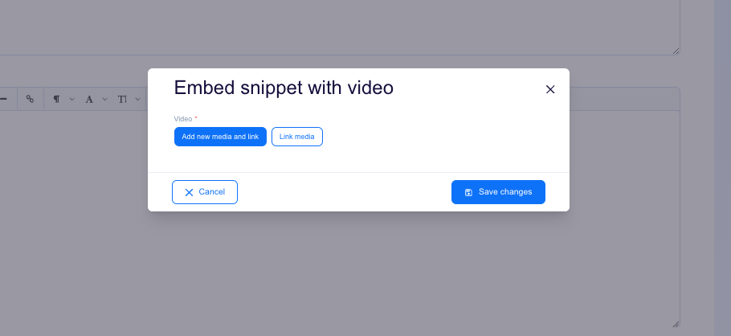
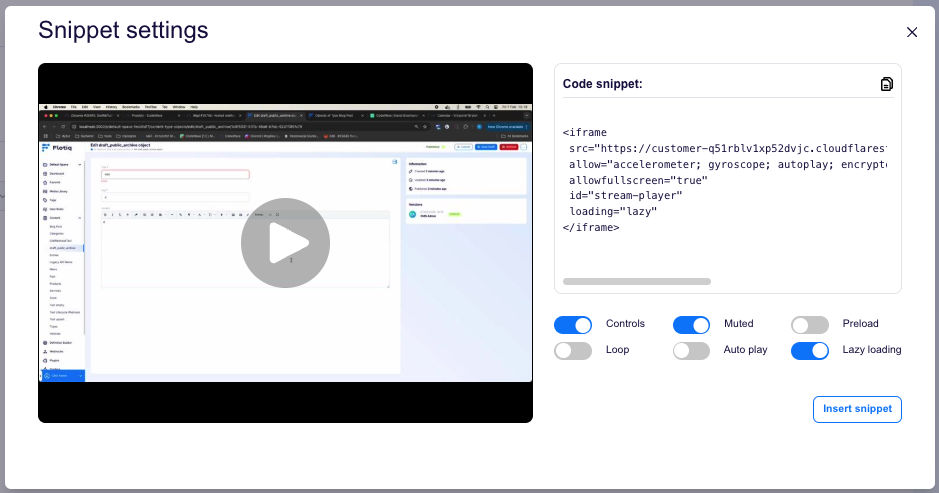
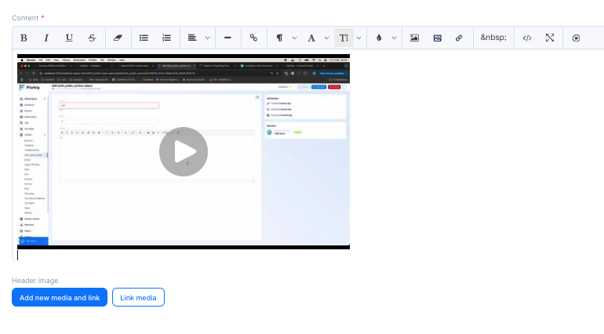

[[_TOC_]]

# Flotiq cloudflare stream plugin

This plugin offers seamless integration of Cloudflare Stream with Flotiq, providing users with an intuitive way to embed
video content directly from the rich text editor. With this solution, adding Cloudflare Stream videos becomes
effortless, eliminating the need for manual embed code insertion. It's a perfect tool for those looking to enhance their
content with multimedia elements while keeping the process simple and efficient.

## Configuration

To start using the plugin, simply fill in the required details using the information from your Cloudflare account.



## Usage

### Generate Snippet

To generate a snippet, go to the edit page of the selected video and click 'Generate Snippet'.



### Using generated snippet

After generating the snippet, it will appear in the same place as the 'Generate Snippet' button.



#### snippet preview
> **Warning**: The video may not be ready for streaming yet. If that's the case, you'll need to check back in a while.

After clicking the 'Snippet Preview' button, a modal will open where you can adjust the video settings and preview the
changes in real time.



### Inserting a snippet directly from the rich text editor.

To inject a snippet directly from the rich text editor, click the player icon at the end of the options bar.



A modal will open, allowing you to select existing media or add new ones.
> **Note**: The plugin only supports video media. Selecting non-video media will result in an error.



After selecting the media, another modal will open where you can adjust the video settings, see a live preview, and
inject it into the editor.



After clicking the 'Inject Snippet' button, the snippet will automatically be added to the rich text editor content.




## Quick start

1. `yarn` - to install dependencies
2. `yarn start` - to start development mode - rebuild on file modifications
3. update your `plugin-manifest.json` file to contain the production URL and other plugin information
4. `yarn build` - to build plugins

## Dev environment

Dev environment is configured to use:

* `prettier` - best used with automatic format on save in IDE
* `eslint` - it is built into both `start` and `build` commands

## Output

The plugins are built into a single `dist/index.js` file. The manifest is copied to `dist/plugin-manifest.json` file.

## Deployment

<!-- TO DO -->

## Loading the plugin

**Warning:** While developing, you can use  `https://localhost:3053/plugin-manifest.json` address to load the plugin
manifest. Make sure your browser trusts the local certificate on the latter, to be able to use it e.g. with
`https://editor.flotiq.com`

### URL

**Hint**: You can use localhost url from development mode `https://localhost:3053/index.js`

1. Open Flotiq editor
2. Open Chrome Dev console
3. Execute the following script
   ```javascript
   FlotiqPlugins.loadPlugin('plugin-id', '<URL TO COMPILED JS>')
   ```
4. Navigate to the view that is modified by the plugin

### Directly

1. Open Flotiq editor
2. Open Chrome Dev console
3. Paste the content of `dist/index.js`
4. Navigate to the view that is modified by the plugin

### Deployment

**Hint**: You can use localhost url from development mode `https://localhost:3053/plugin-manifest.json`

1. Open Flotiq editor
2. Add a new plugin and paste the URL to the hosted `plugin-manifest.json` file
3. Navigate to the view that is modified by the plugin
